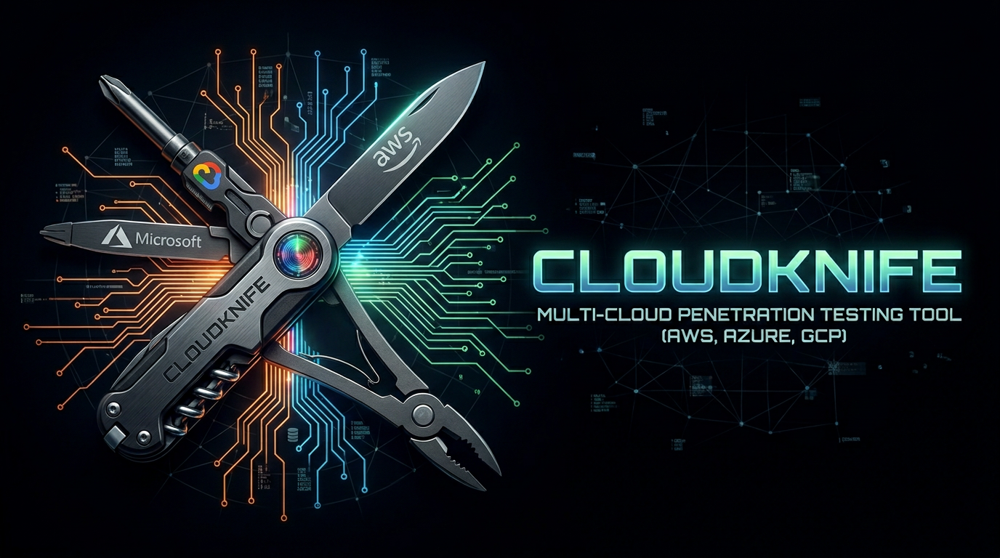

# CloudKnife



**Multi-cloud post-exploitation and penetration testing tool for AWS, GCP, and Azure.**

Inspired by [Pacu](https://github.com/RhinoSecurityLabs/pacu), CloudKnife extends the concept of AWS exploitation to a unified multi-cloud tool. It provides an interactive CLI for authorized security assessments across AWS, GCP, and Azure with a session-based workflow for enumeration, exfiltration, lateral movement, exploitation, and persistence.

---

## ⚠️ Legal Disclaimer

**THIS TOOL IS FOR AUTHORIZED SECURITY TESTING ONLY**

CloudKnife is a penetration testing tool designed exclusively for:
- Authorized security assessments and penetration tests
- Red team operations with proper authorization
- Security research in controlled environments
- Educational purposes in lab environments

**Unauthorized access to cloud infrastructure or computer systems is illegal.** Users are responsible for complying with all applicable laws and regulations. Always obtain explicit written authorization before testing any systems you do not own.

By using this tool, you acknowledge that you understand and accept these terms.

---

## Features

### Multi-Cloud Support

| Capability | AWS | GCP | Azure |
|---|:---:|:---:|:---:|
| Session Management | x | x | x |
| IAM Enumeration | x | x | x |
| Permission Bruteforce | x | x | x |
| Storage Enumeration | x | x | x |
| Secrets Exfiltration | x | x | x |
| Lateral Movement | x | x | - |
| Exploitation / RCE | x | - | x |
| Persistence | x | x | - |
| Command Logging | x | x | x |

### AWS

- **Enumeration:** IAM users, roles, groups, policies, EC2 instances, Lambda functions, S3 buckets (with full versioning + delete markers), EBS snapshots, RDS instances, DynamoDB tables, Secrets Manager, SSM Parameter Store, ECR repos, SNS topics, Amazon MQ, OIDC identity providers, and more
- **Permission Bruteforce:** Test 50+ services across three intensity modes (fast/full/low) via unauthenticated and authenticated approaches
- **Exfiltration:** S3 objects (single/bulk/versioned download modes), EBS snapshots, DynamoDB scans, Secrets Manager values, SSM Parameter Store values (single/bulk with KMS decryption), EC2 Windows passwords, RDS IAM auth tokens, full IAM authorization graph export
- **Exploitation:** SSM remote command execution (Linux/Windows), interactive SSM sessions, EC2 userData startup shell injection
- **Lateral Movement:** STS AssumeRole with automatic session creation and full credential display
- **Persistence:** IAM access key creation/management
- **Advanced:** Cross-account user enumeration (unauthenticated), OIDC trust policy vulnerability scanning, OIDC provider enumeration, privilege escalation path analysis

### GCP

- **Enumeration:** Compute instances, Cloud Storage buckets/objects, Cloud Functions (v1/v2), Cloud SQL instances (MySQL/PostgreSQL/SQL Server with security analysis), IAM policies, service accounts, Parameter Manager, Secret Manager, Artifact Registry, role inspection
- **Permission Bruteforce:** Test permissions via `testIamPermissions` API across three modes (fast/full/low) with dangerous permission highlighting
- **Exfiltration:** Storage objects (single/bulk), Parameter Manager values with automatic base64 decoding, Secret Manager values
- **Lateral Movement:** Service account impersonation (direct + implicit delegation chains), JWT signing (`signJwt`), blob signing (`signBlob`), SA key creation for persistence, SA IAM policy manipulation (`setIamPolicy`) for privilege escalation
- **Advanced:** Impersonation graph mapping, delegation chain discovery (works without IAM read access), exploitable SA enumeration, Cloud SQL security scanning (public IP detection, SSL enforcement, open access 0.0.0.0/0)

### Azure

- **Enumeration:** Entra ID users, groups, group members, role assignments, all Azure resources (VM, storage, Container Apps, etc.), Administrative Units (members + scoped roles), Key Vault secrets (with firewall fallback), Storage blob containers, Virtual Machines (with detailed properties)
- **Token Exchange Discovery (CloudProwl):** Automatic discovery of accessible Microsoft services from refresh token - tests 8 services (Graph, ARM, DevOps, Power Platform, Teams, Exchange) via token exchange
- **Permission Bruteforce:** Test 90+ Microsoft Graph API permissions via actual HTTP calls across two intensity modes (fast: ~31 permissions / full: ~90 permissions) with **intelligent false positive detection** - write operations returning 404 are marked as "UNCERTAIN" with clear warnings to prevent false positives, incremental merge logic to preserve permissions across multiple runs
- **Microsoft Graph Operations:** Mail folders/messages, Teams channels/messages, SharePoint sites/document libraries, OneDrive/SharePoint files (with download), App registrations/service principals, Conditional Access policies
- **Exfiltration:** Blob storage download (AAD auth + SAS token support), Key Vault secret values, Graph API file downloads with progress bars, Container Apps secrets and environment variables, VM App Settings
- **Exploitation:** Entra ID user password change via Microsoft Graph API, Entra ID MFA bypass via Teams native authentication, VM RunCommand execution
- **Auth:** Service principal (client secret), interactive browser login (with Azure CLI fallback), device code flow, stolen/SSRF access tokens, refresh tokens (with auto-discovery), managed identity
- **SDK-Native:** Primary Azure SDK usage with automatic Azure CLI fallback for Conditional Access compatibility, 5-6x faster than CLI-only operations, automatic token refresh

---

## Installation

### Prerequisites

- Python 3.10+
- pip

### Setup

```bash
git clone https://github.com/caius-codes/cloudknife.git
cd cloudknife
python -m venv venv
source venv/bin/activate  # Linux/macOS
pip install -e .
```

This installs CloudKnife in editable mode along with all dependencies. You can now launch the tool using either:

```bash
cloudknife           # Installed command (recommended)
python -m src.cli    # Direct module execution
```

### Cloud-Specific Dependencies

| Provider | Required CLI | Purpose |
|----------|-------------|---------|
| AWS | - | Uses boto3 SDK directly |
| GCP | - | Uses google-cloud SDKs + REST API |
| Azure | Azure CLI (optional, recommended) | Primary: Azure SDKs (azure-identity, azure-mgmt-*, azure-storage-blob). Fallback: Azure CLI for Conditional Access compatibility and authentication. Install from [Microsoft docs](https://docs.microsoft.com/en-us/cli/azure/install-azure-cli) |

**Note:** Azure no longer requires Azure CLI. All operations use native Azure SDKs for improved performance and reliability.

### Terminal Icons (Optional)

CloudKnife displays cloud provider icons in the CLI prompt for better visual distinction. **Icons are rendered in bold** for increased prominence. By default, it uses Unicode emoji (⚡ for AWS, 🔴 for GCP, 🔷 for Azure) which work on all modern terminals.

**For proper cloud provider logos**, install a [Nerd Font](https://www.nerdfonts.com/):

#### Recommended Font

Download **[JetBrains Mono Nerd Font](https://github.com/ryanoasis/nerd-fonts/releases/download/v3.4.0/JetBrainsMono.zip)** (or any other Nerd Font from the [latest release v3.4.0](https://github.com/ryanoasis/nerd-fonts/releases/tag/v3.4.0))

**Note:** You MUST use Nerd Fonts **v3.0+** for correct cloud provider icons. Older versions may display incorrect glyphs.

#### Installation

**macOS:**
```bash
# Download and install
wget https://github.com/ryanoasis/nerd-fonts/releases/download/v3.4.0/JetBrainsMono.zip
unzip JetBrainsMono.zip -d ~/Library/Fonts/
```

**Linux:**
```bash
# Download and install
wget https://github.com/ryanoasis/nerd-fonts/releases/download/v3.4.0/JetBrainsMono.zip
unzip JetBrainsMono.zip -d ~/.local/share/fonts/
fc-cache -fv
```

**Windows:**
```powershell
# Download from https://github.com/ryanoasis/nerd-fonts/releases/download/v3.4.0/JetBrainsMono.zip
# Extract and right-click on .ttf files → Install
```

#### Terminal Configuration

After installing the font, configure your terminal:

- **iTerm2** (macOS): Preferences → Profiles → Text → Font → "JetBrainsMono Nerd Font"
- **Windows Terminal**: Settings → Profiles → Appearance → Font face → "JetBrainsMono Nerd Font"
- **VSCode**: Settings → Terminal → Integrated: Font Family → `"JetBrainsMono Nerd Font"`
- **Alacritty**: `~/.config/alacritty/alacritty.yml`:
  ```yaml
  font:
    normal:
      family: "JetBrainsMono Nerd Font"
  ```

#### Manual Icon Control

**Global Override** (all icons):

```bash
# Force Nerd Font icons
export CLOUDKNIFE_ICONS=nerd

# Force Unicode emoji (default)
export CLOUDKNIFE_ICONS=emoji

# Disable icons (text only)
export CLOUDKNIFE_ICONS=plain
```

**Per-Icon Override** (individual fallback):

Mix Nerd Font with emoji fallbacks for broken glyphs:

```bash
# Use Nerd Font globally, but emoji for AWS if glyph is broken
export CLOUDKNIFE_ICONS=nerd
export CLOUDKNIFE_AWS_ICON=emoji

# Force emoji only for GCP
export CLOUDKNIFE_GCP_ICON=emoji

# Hide Azure icon completely
export CLOUDKNIFE_AZURE_ICON=plain

# Use emoji for all except AWS (use Nerd Font)
export CLOUDKNIFE_ICONS=emoji
export CLOUDKNIFE_AWS_ICON=nerd
```

Per-icon overrides take precedence over global settings. Available per-icon variables:
- `CLOUDKNIFE_AWS_ICON` - AWS icon override (`nerd`/`emoji`/`plain`)
- `CLOUDKNIFE_GCP_ICON` - GCP icon override (`nerd`/`emoji`/`plain`)
- `CLOUDKNIFE_AZURE_ICON` - Azure icon override (`nerd`/`emoji`/`plain`)

#### Test Icons

```bash
python3 -m src.core.icons
```

This displays all icon modes and helps verify your terminal configuration.

---

## Usage

### Start CloudKnife

```bash
cloudknife
```

### Cloud Provider Selection

On startup, select a cloud provider:

```
Select cloud provider:
  1 - AWS
  2 - GCP
  3 - Azure
```

Switch between providers at any time with the `cloud` command.

### Session Workflow

CloudKnife uses a session-based approach. Each session stores credentials, project/account context, and enumeration results independently.

```
# Create/load a session
new_session pentest-client-x

# Set credentials (varies by provider)
set_credentials path/to/key.json   # GCP service account
set_token <access_token>           # Stolen token (SSRF, metadata, etc.)
set_adc                            # Application Default Credentials
set_keys                           # AWS access key + secret

# Check identity
whoami
```

### Example Workflows

#### AWS - Enumerate and Exfiltrate

```
set_keys
whoami
enumerate_iam_users
enumerate_s3
bruteforce_permissions fast
privesc_paths
get_secret my-database-credentials
exfil_bucket my-sensitive-bucket
```

#### GCP - Impersonation Chain

```
set_token <token_from_metadata>
enumerate_exploitable_sas
enumerate_delegation_chains
impersonate target-sa@project.iam.gserviceaccount.com
create_sa_key target-sa@project.iam.gserviceaccount.com
```

#### Azure - Entra ID Enumeration

```
# Service principal authentication
set_service_principal
enum_users
enum_groups
enum_roles
enum_keyvault_secrets

# Or use interactive/device code login
login_interactive  # Browser-based
login_device_code  # For remote sessions

# Or use stolen access token
set_token
```

---

## Command Reference

### General (all providers)

| Command | Description |
|---------|-------------|
| `help` | Show available commands |
| `whoami` | Display current identity |
| `cloud [aws\|gcp\|azure]` | Switch cloud provider |
| `list_sessions` | List all saved sessions |
| `new_session <name>` | Create a new session |
| `use_session <name>` | Switch to existing session |
| `show_config` | Display current session configuration |
| `exit` | Exit CloudKnife |

### AWS Commands

<details>
<summary>Expand AWS commands</summary>

**Credential Management**
- `set_keys` - Set AWS access key, secret key, session token
- `set_regions` - Configure regions for enumeration

**Enumeration**
- `enumerate_iam_users` / `enumerate_iam_roles` / `enumerate_iam_groups` / `enumerate_iam_policies`
- `enumerate_ec2` / `enumerate_lambda` / `enumerate_s3` / `enumerate_s3_objects <bucket>`
- `enumerate_ebs_snapshots` / `enumerate_secrets` / `enumerate_rds` / `enumerate_rds_snapshots`
- `enumerate_dynamodb` / `dynamodb_details <table>` / `enumerate_ecr` / `enumerate_mq` / `enumerate_sns`
- `enumerate_oidc_providers` - Enumerate OpenID Connect identity providers (issuer URLs, client IDs, thumbprints, tags)
- `bruteforce_permissions [fast|full|low]` - IAM permission bruteforce
- `privesc_paths` - Analyze privilege escalation paths
- `enumerate_vulnerable_oidc` - Scan for vulnerable GitHub OIDC trust policies
- `enum_users_unauth <role_arn>` - Cross-account user enumeration (unauthenticated)
- `quick_enum` - Quick resource count overview

**Exfiltration**
- `get_secret <name>` - Retrieve secret value
- `download_object <bucket> <key> [version_id]` / `download_bucket <bucket> [latest|all]` - S3 download with full versioning support (download specific versions or all versions)
- `download_ebs_snapshot` - Download EBS snapshot
- `dynamodb_scan <table>` - Scan and export DynamoDB table
- `get_ec2_password <instance_id> <key_path>` - Decrypt Windows EC2 password
- `rds_iam_token` - Generate RDS IAM authentication token
- `export_iam_graph` - Export full IAM authorization details

**Exploitation**
- `ssm_rce <instance_id> <command>` - Execute commands on EC2 via SSM
- `ssm_session <instance_id>` - Interactive SSM session
- `ec2_startup_shell <instance_id>` - Inject reverse shell via userData

**Lateral Movement**
- `assume_role <role_arn>` - Assume IAM role (creates new session)

**Persistence**
- `create_access_key [username]` - Create IAM access key
- `list_access_keys [username]` / `delete_access_key [username] [key_id]`

</details>

### GCP Commands

<details>
<summary>Expand GCP commands</summary>

**Credential Management**
- `set_credentials <path>` - Set service account JSON key
- `set_adc` - Use Application Default Credentials
- `set_token <token> [project]` - Set raw access token
- `set_project <id>` / `set_projects` / `set_zones`

**Enumeration**
- `enumerate_compute` / `enumerate_storage` / `enumerate_objects <bucket>`
- `enumerate_functions [v1|v2|all]` / `enumerate_iam` / `enumerate_parameters` / `enumerate_secrets`
- `enumerate_sql` - Enumerate Cloud SQL instances (MySQL/PostgreSQL/SQL Server) with security analysis (public IP, SSL requirements, open access detection)
- `enumerate_artifact_repositories` / `enumerate_artifact_packages` / `enumerate_artifact_versions`
- `bruteforce_permissions [fast|full|low]` - IAM permission bruteforce
- `privesc_paths` - Privilege escalation path analysis
- `enumerate_exploitable_sas` - Find SAs with dangerous permissions
- `enumerate_delegation_chains` - Discover implicit delegation (works without IAM read)
- `who_can_impersonate <sa>` / `describe_role <role>` / `list_roles`

**Exfiltration**
- `download_object <bucket> <object>` / `exfil_bucket <bucket>`
- `exfil_parameters` / `exfil_parameter <name>` - Parameter Manager extraction

**Lateral Movement**
- `map_impersonation [project]` - Map impersonation graph
- `find_chains [target_sa]` - Find delegation chains
- `impersonate [sa | chain N]` - Impersonate service account
- `sign_jwt [sa]` / `sign_blob [sa]` - JWT/blob signing exploitation
- `create_sa_key [sa]` / `list_sa_keys [sa]` / `delete_sa_key [sa] [key_id]`
- `get_sa_iam_policy [sa]` / `set_sa_iam_policy [sa] [member] [role]`

</details>

### Azure Commands

<details>
<summary>Expand Azure commands</summary>

**Authentication (Native SDK)**
- `set_service_principal` - Configure service principal (tenant_id, client_id, client_secret)
- `login_interactive` - Browser-based interactive login
- `login_device_code` - Device code flow for remote/SSH sessions
- `set_token` - Set stolen/SSRF access token (no refresh capability)
- `set_refresh_token` - Set refresh token and auto-discover accessible services (CloudProwl technique) - automatically tests 8 Microsoft services
- `login_managed_identity` - Managed identity authentication (Azure VM/container)
- `az_login` - Legacy CLI-based authentication (requires Azure CLI)

**Enumeration**
- `discover_services` / `cloudprowl` - Discover accessible Microsoft services via token exchange (Graph, ARM, DevOps, Power Platform, Teams, Exchange) - requires refresh_token auth
- `enum_users` - List all Entra ID users (with pagination)
- `enum_groups` - List all Entra ID groups
- `enum_group_members` - List members of a specific group
- `enum_roles` - List role assignments for current user
- `enum_all_roles` - List all role assignments in subscription
- `enum_keyvault_secrets` - List secrets in Key Vault (with firewall fallback)
- `enum_blobs` - List blobs in storage container (AAD or SAS auth)
- `enum_administrative_units` - List administrative units
- `enum_administrative_unit_members` - List direct members of admin unit
- `enum_administrative_unit_scoped_members` - List scoped role members of admin unit
- `enum_resources` - List all resources in subscription (SDK with CLI fallback)
- `enum_functions` - Enumerate Azure Functions in a Function App
- `enum_webapps` - Enumerate Web Apps in subscription
- `enum_container_apps` - Enumerate Azure Container Apps with configuration details
- `enum_vms` - Enumerate Virtual Machines with detailed properties
- `bruteforce_graph_permissions [fast|full]` - Microsoft Graph API permission bruteforce via HTTP calls (fast: ~31 permissions, full: ~90 permissions) with **false positive detection** - write operations returning 404 marked as "UNCERTAIN"

**Microsoft Graph Operations** (Post-Exploitation)
- `graph_mail` - Enumerate mail folders and messages with download to JSON (requires `Mail.Read`)
- `graph_teams` - Enumerate Teams, channels, and messages with full conversation download (requires `Team.ReadBasic.All`, `ChannelMessage.Read.All`)
- `graph_sharepoint` - Enumerate SharePoint sites and document libraries (requires `Sites.Read.All`)
- `graph_files` - Enumerate OneDrive/SharePoint files with recursive traversal and streaming downloads (requires `Files.Read.All`)
- `graph_apps` - Enumerate app registrations and service principals with permission analysis (requires `Application.Read.All`)
- `graph_ca_policies` - Enumerate Conditional Access policies with detailed conditions and controls (requires `Policy.Read.All`)

**Exfiltration**
- `download_blob` - Download blob from storage (AAD or SAS token auth)
- `exfil_container_app_secrets` - Extract secrets and environment variables from Container Apps
- `exfil_vm_app_settings` - Extract application settings from Virtual Machines

**Exploitation**
- `change_user_password` - Change Entra ID user password via Graph API
- `mfa_bypass` - Bypass MFA using Teams native authentication (ROPC flow)
- `vm_run_command` - Execute commands on Virtual Machine via RunCommand API

**Passthrough**
- `az ...` - Execute any Azure CLI command (requires Azure CLI installed)

</details>

---

## Architecture

```
cloudknife/
├── src/
│   ├── cli.py                          # Entry point, cloud selector
│   ├── core/
│   │   └── session.py                  # Base session management
│   ├── data/
│   │   ├── iam_actions_wordlist.py     # AWS permission wordlists
│   │   └── gcp_iam_permissions.py      # GCP permission database
│   ├── logging/
│   │   └── command_logger.py           # JSONL audit logging
│   └── clouds/
│       ├── aws/
│       │   ├── aws_cli.py              # AWS interactive REPL
│       │   ├── aws_session.py          # AWS credential management
│       │   └── modules/
│       │       ├── enumeration/        # 20+ enumeration modules
│       │       ├── exfiltration/       # S3, EBS, DynamoDB, Secrets, RDS
│       │       ├── exploitation/       # SSM RCE, userData injection
│       │       ├── lateral/            # STS AssumeRole
│       │       └── persistence/        # Access key management
│       ├── gcp/
│       │   ├── gcp_cli.py              # GCP interactive REPL
│       │   ├── gcp_session.py          # GCP credential management
│       │   └── modules/
│       │       ├── enumeration/        # Compute, Storage, IAM, Functions
│       │       ├── exfiltration/       # Storage, Parameter Manager
│       │       └── lateral_movement/   # Impersonation, JWT, keys, IAM
│       └── azure/
│           ├── azure_cli.py            # Azure interactive REPL
│           ├── azure_session.py        # Azure credential management
│           └── modules/
│               ├── enumeration/        # Entra ID, Storage, Key Vault
│               ├── exfiltration/       # Blob download
│               └── exploitation/       # Password change
├── sessions/                           # Persistent session storage
├── logs/                               # JSONL command audit logs
└── exfil/                              # Exfiltrated data staging
```

### Design Principles

- **Session isolation:** Each session maintains its own credentials, context, and enumeration data. Switch between targets without losing state.
- **Dual auth paths:** Modules support both client library auth (service account/ADC) and raw access token auth (REST API) for maximum flexibility with stolen tokens.
- **Audit trail:** Every command is logged in JSONL format with timestamps, session IDs, and execution status.
- **Minimal footprint:** No agents, no persistence by default. Explicit commands for any write operation.

---

## Logging

All commands are logged to `logs/commands_YYYYMMDD.jsonl`:

```json
{
  "timestamp": "2025-01-15T14:30:00Z",
  "cloud": "aws",
  "session_id": "a1b2c3d4",
  "session_name": "pentest-client",
  "command": "enumerate_s3",
  "status": "executed"
}
```

---

## Contributing

1. Fork the repository
2. Create a feature branch (`git checkout -b feature/new-module`)
3. Follow existing module patterns (see any file in `modules/enumeration/` as reference)
4. Ensure all table outputs use `overflow="fold", no_wrap=False` to prevent truncation
5. Submit a pull request

### Adding a New Module

Each module follows a consistent pattern:

1. Create the module file in the appropriate directory (`enumeration/`, `exfiltration/`, etc.)
2. Export functions in the package `__init__.py`
3. Import in the cloud CLI file (`aws_cli.py`, `gcp_cli.py`, `azure_cli.py`)
4. Add the command to the autocompleter
5. Add command handler in the REPL loop
6. Add help entry in the UI file

---

## License

This project is licensed under the MIT License. See [LICENSE](LICENSE) for details.

---

## Acknowledgments

- Developed through vibecoding with [Claude](https://claude.ai) (Anthropic)
- Hardly inspired by [Pacu](https://github.com/RhinoSecurityLabs/pacu) (AWS exploitation tool)
- AWS enumeration techniques inspired by [aws-enumerator](https://github.com/shabarkin/aws-enumerator) by [@shabarkin](https://github.com/shabarkin)
- Several Azure Graph modules are Python ports of techniques from [GraphRunner](https://github.com/dafthack/GraphRunner) by [@dafthack](https://github.com/dafthack) — specifically mail, Teams, SharePoint, OneDrive, and app enumeration flows
- Teams native API authentication (ROPC flow, SkypeToken acquisition, chatService routing) is a Python port of techniques from [AADInternals](https://github.com/Gerenios/AADInternals) by [@NestoriSyynimaa](https://github.com/NestoriSyynimaa)
- Azure MFA bypass audit module (`audit_mfa_gaps`) is based on [FindMeAccess](https://github.com/absolomb/FindMeAccess) by [@absolomb](https://github.com/absolomb) (Ryan McFarland) — client IDs, resources, user agents, and ROPC testing logic
- Azure token exchange discovery (`discover_services`/`cloudprowl`) is based on [CloudProwl](https://github.com/pwnedlabs/cloudprowl) by [Pwned Labs](https://github.com/pwnedlabs) — OAuth token exchange technique for service discovery
- Built with [Rich](https://github.com/Textualize/rich) for terminal UI
- Uses [prompt_toolkit](https://github.com/prompt-toolkit/python-prompt-toolkit) for interactive CLI

